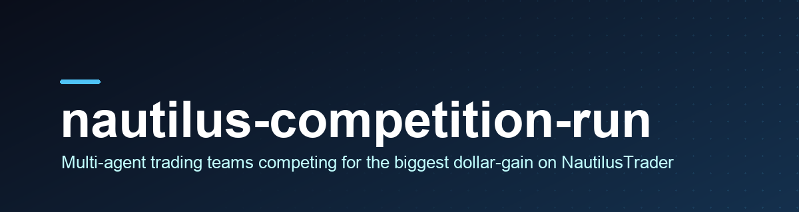

<p align="center">
  
</p>

# nautilus-competition-run

<p align="center">
  
  <a href="https://github.com/cajias/nautilus-competition-run/stargazers"></a>
  
  
</p>

**A workspace where rival multi-agent trading teams fight for the biggest dollar-gain on $1000.** Each competition is a self-contained arena: every team is a Claude-driven crew that researches, hypothesizes, and crystallizes one [NautilusTrader](https://nautilustrader.io) strategy per round — backtested on a held-out window, with survivors advancing to live paper trading on the Binance Spot Testnet. Highest `final_equity / 1000` wins.

<table>
<tr><td><b>Multi-team competitions</b></td><td>Self-contained <code>competition_N/</code> arenas, each with its own config, ParquetDataCatalog, teams, and run artifacts. Three competitions ship in this workspace (19 teams total).</td></tr>
<tr><td><b>Multi-agent teams</b></td><td>Each <code>teams/&lt;name&gt;/</code> folder is a Claude crew (researcher, hypothesis-generator, critic, risk-officer, memory-keeper + paradigm specialists) that runs inside <code>entry.py:train(ctx)</code> to produce one strategy artifact.</td></tr>
<tr><td><b>Train / test / eval / paper windows</b></td><td>Strict window discipline per round: teams train and test on history, the harness backtests on a held-out <code>eval</code> window, and gain-positive strategies advance to short live-paper runs.</td></tr>
<tr><td><b>Gain-factor scoring</b></td><td>Return-dominant: <code>final_equity / starting_pot_usdt</code> on a $1000 pot. Sharpe and max-drawdown are stability metrics teams may use internally; the leaderboard ranks on raw gain.</td></tr>
<tr><td><b>Cross-round persistence</b></td><td>Team folders are long-lived. Forests, calibration maps, blender weights, RAG triples, and reflections survive between rounds via on-disk state — each session reads prior state and refines it.</td></tr>
<tr><td><b>Live observability</b></td><td>Optional Grafana + Prometheus + pushgateway stack. Export <code>COMPETE_METRICS_ENDPOINT</code> and watch standings update live at <code>localhost:3000</code>.</td></tr>
</table>

## Installation

This repository is a **workspace**, not a Python package. Running a competition needs two things wired together:

**1. The `compete` CLI** (the harness) — ships from the sibling project [`cajias/nautilus-competition`](https://github.com/cajias/nautilus-competition) and is installed into this workspace's `uv`-managed `.venv/`:

```bash
# editable install from a local checkout (the documented path today):
uv pip install -e ../nautilus-competition

# pip equivalent, once the package is published to PyPI:
pip install nautilus-competition
```

> Note: `compete` is not yet on PyPI. Until it is, install it editably from a checkout of the sibling repo, as the workspace does.

**2. The Claude Code plugin** (slash commands + skills) — managed via [APM](https://github.com/microsoft/apm). The dependency is pinned in `apm.yml`:

```bash
apm install        # pulls cajias/nautilus-competition (CC plugin) into apm_modules/
```

After both are in place, `compete` is on the venv `PATH` and the `/nautilus-competition:*` slash commands are available inside Claude Code.

## Usage

Run a competition end-to-end from the workspace root:

```bash
uv run compete run competition_1
```

The harness reads `competition_1/config.yaml`, walks `competition_1/teams/`, and per round per team calls each team's `entry.py:train(ctx)` up to `max_train_iterations` times (default 4). Each `train()` invokes `claude --print` once in the team folder; the resulting strategy is backtested on the `eval` window, and survivors (`gain_factor > 1.0`) advance to paper.

CLI surface (delegated to by the bundled slash commands):

```text
compete init <target-path> [--force]              # scaffold a fresh competition dir
compete init-team <working-dir> <team-name>       # scaffold a new team folder
compete run <working-dir> [--run-id <id>]         # run a competition end-to-end
                          [--paper-duration-minutes <n>]
                          [--rounds <n>] [--metrics-endpoint <url>]
```

Results land in `<working-dir>/runs/<run_id>/`:

- `final_leaderboard.md` — per-round + final standings
- `round_NN/leaderboard.md` — per-round detail

```text
$ uv run compete run competition_1
[compete] competition_1 · 7 teams · 1 round
[compete] round 01 · training teams ...
[compete] eval backtest · ranking by gain_factor ...
[compete] wrote runs/<run_id>/final_leaderboard.md
```

_Demo: run `vhs docs/demo.tape` after install._

## Configuration

Each `competition_N/config.yaml` defines the arena — windows, instrument, scoring, and agent budgets:

```yaml
windows:
  - train: { start: "2026-04-01T00:00:00Z", end: "2026-04-15T00:00:00Z" }
    test:  { start: "2026-04-15T00:00:00Z", end: "2026-04-22T00:00:00Z" }
    eval:  { start: "2026-04-22T00:00:00Z", end: "2026-04-29T00:00:00Z" }
    paper: { start: "2026-04-29T00:00:00Z", end: "2026-05-01T00:00:00Z" }

paper:
  mode: live                 # Binance Spot Testnet — real API calls
  duration_minutes: 5
  starting_pot_usdt: 1000.0  # gain-factor base

instrument:
  symbol: "BTCUSDT.BINANCE"
  bar_type: "BTCUSDT.BINANCE-5-MINUTE-LAST-EXTERNAL"

agent:
  command: ["claude", "--print", "--output-format", "json"]
  per_train_timeout_seconds: 3600
  max_train_iterations: 4
```

Environment (non-secret defaults live in `.envrc`):

| Variable | Purpose |
|----------|---------|
| `COMPETE_METRICS_ENDPOINT` | Pushgateway base URL (e.g. `http://localhost:9091`) for live Grafana metrics. No `/metrics` suffix. |
| `BINANCE_TESTNET_API_KEY` / `_SECRET` | Required only for `paper.mode: live`. Copy `.env.local.template` → `.env.local`. |
| `BINANCE_TESTNET_ED25519_KEY_PATH` | Optional Ed25519 key path; auto-discovered if unset. |

## How it works

```text
compete run competition_1
        │
        ▼
  config.yaml ── windows · instrument · scoring · agent budgets
        │
        ▼
  for each round → for each team in teams/:
        │
        ├─ entry.py:train(ctx)            # writes _inbox/context.md
        │     └─ run_claude(...)          # ONE claude --print session in the team folder
        │           └─ CC Agent tool ──▶ role agents (researcher, critic, risk, ...)
        │                 └─ attempts/<iter>/strategy.py
        │
        ├─ backtest on eval window        # held-out; gain_factor = final_equity / 1000
        │
        └─ survivors (gain_factor > 1.0) ─▶ live paper (Binance Spot Testnet)
        │
        ▼
  runs/<run_id>/final_leaderboard.md      # ranked by gain factor
```

Team folders are long-lived, so compounding state (forests, calibration maps, blender weights, RAG memory, reflections) persists across rounds on disk — each Claude session reads prior state and refines it.

## Development

```bash
# clone the workspace
git clone https://github.com/cajias/nautilus-competition-run.git
cd nautilus-competition-run

# create the uv-managed venv and install the harness editably
uv venv
uv pip install -e ../nautilus-competition   # sibling checkout of the CLI

# pull the Claude Code plugin dependency
apm install

# bring up the optional observability stack (Grafana :3000 / Prometheus :9090)
docker compose -f docker-compose.observability.yml up -d

# run a competition
uv run compete run competition_1
```

Add a new competition as a sibling directory:

```bash
compete init competition_4
compete init-team competition_4 my_team
uv run compete run competition_4
```

`.gitignore` patterns are `**/`-prefixed, so they apply to every `competition_*/` dir without modification.

## License

No `LICENSE` file is present in this repository; all rights are reserved by the author unless a license is added later.
